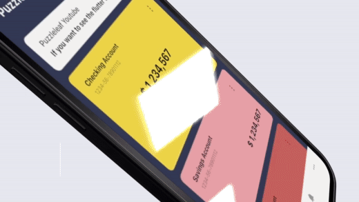
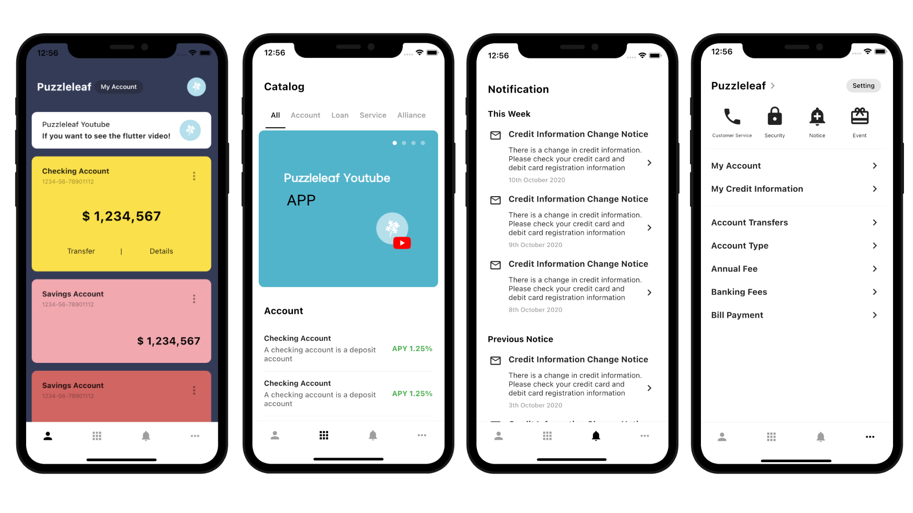
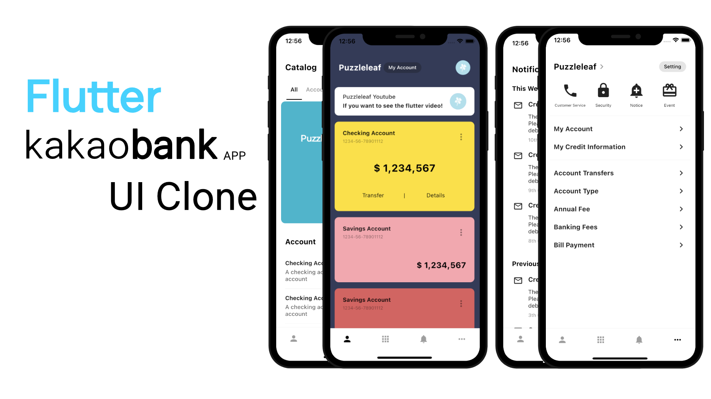

# Flutter KakaoBank UI Clone

The Kakao Bank app is a banking application in Korea.

 

 

## Youtube
[Flutter KakaoBank UI Clone - Speed Code](https://youtu.be/FfQOeCwY-Oc)

 

## Reference
* KakaoBank : https://www.kakaobank.com

## Packages
* flutter_bloc : https://pub.dev/packages/flutter_bloc

## Keyword
* SliverAppBar, SliverList, SliverChildListDelegate, TabBar, CustomScrollView, PageStorageKey, GlobalKey, ensureVisible, findRenderObject
